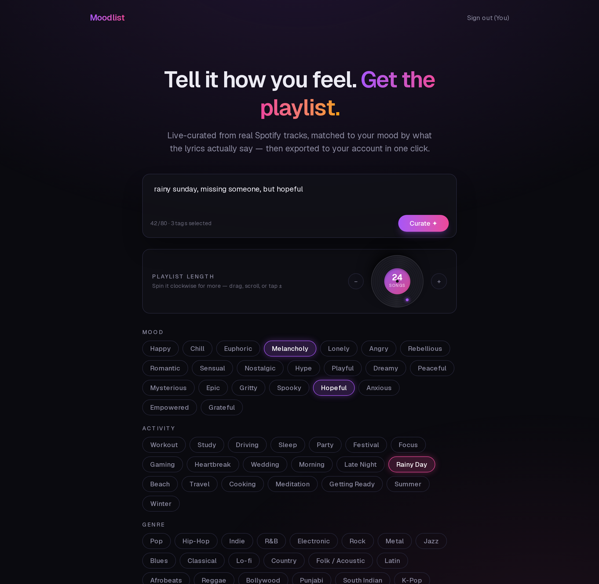
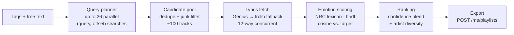

# Moodlist — live mood-curated Spotify playlists

**Live at [moodlist-app.vercel.app](https://moodlist-app.vercel.app)**

Type how you feel, spin a vinyl to pick the playlist length, and get a
live-curated playlist of real Spotify tracks — **ranked by what their lyrics
actually say**, not by a pre-baked database. One click exports it to your
Spotify account.



## Why this is harder than it sounds

Spotify **removed its audio-features and analysis endpoints** (the classic
valence/energy/danceability API) for new apps. You can't ask Spotify what a
song feels like anymore. Moodlist's answer: read the lyrics.

**Everything is computed live, per request.** There is no track database, no
offline index, no cached catalog — every playlist is searched, fetched,
scored, and ranked in the seconds after you hit *Curate*, with progress
streamed to the UI over Server-Sent Events.

## The pipeline



1. **Search fan-out.** Spotify caps `GET /search` at 10 results per request,
   so breadth comes from parallelism: the literal text paginated 4 pages
   deep, an `artist:"..."` field-filtered variant, the text crossed with
   genre/mood seeds from your tags, plus seed-pair queries — up to 26
   requests at once.
2. **Pool building.** Results are deduped by track ID, compilation junk
   (mashups, megamixes, DJ nonstops) is filtered out, and re-releases of the
   same song collapse to one copy — *except* versions of a song you
   literally searched for, which all stay.
3. **Lyrics.** Each candidate's lyrics are found via the Genius API and
   scraped server-side, with [lrclib.net](https://lrclib.net) as fallback.
   Lyrics are used **internally only** for scoring — never displayed,
   returned, or stored (no copyrighted text reproduction).
4. **Emotion scoring.** Lyrics are scored against the bundled, offline
   [NRC Emotion Lexicon](https://saifmohammad.com/WebPages/NRC-Emotion-Lexicon.htm)
   into a 10-dimension emotion vector, weighted by **sublinear tf-idf
   computed over that request's own lyric corpus** — so words that appear in
   every song ("love", "baby") stop dominating. Your tags + text build a
   target vector in the same space; tracks rank by cosine similarity.
5. **Confidence.** Every score carries a confidence derived from lexicon hit
   count × coverage. Thin evidence blends the score toward neutral — a song
   with six matched words can't confidently outrank a real lyrical match.
   Instrumental? No usable lyrics? The app says so instead of pretending.
6. **Honest fallbacks.** If your input has no emotional signal at all
   (an artist name, "hindi", genre-only tags), Moodlist doesn't fake a mood
   target — it ranks by pure search relevance and skips lyric fetching
   entirely. And anything you *literally asked for* (artist or song title in
   your text) ranks ahead of mood scoring, so searching an instrumental
   artist actually returns their catalog.

Every recommendation is explainable: click any result to see its top
emotion dimensions, lyric confidence, and a one-line reason it was picked.

## Engineering war stories

Things that broke because the platform moved underneath us, and how they
were fixed:

| Problem | Fix |
| --- | --- |
| Spotify killed audio-features/analysis for new apps | Mood from lyrics: NRC emotion lexicon, bundled offline (no sentiment API at request time) |
| `GET /search` hard-caps `limit=10` (400 above it) | Fan-out: many small parallel `(query, offset)` pages instead of one big one |
| Search results silently **stopped including `popularity`** (2026) | Derive a 0–100 proxy from Spotify's own relevance rank (`offset + index`), keep the best rank across queries |
| `POST /playlists/{id}/tracks` returns a bare 403 (Feb 2026 rename) | Use `POST /playlists/{id}/items` |
| Spotify rejects `localhost` redirect URIs (2025 rule) | Use the loopback IP literal `http://127.0.0.1:3000` |
| …but Next.js `NextRequest` **normalizes `127.0.0.1` to `localhost`**, corrupting the OAuth `redirect_uri` | Bypass next-auth's handler wrapper: call `@auth/core`'s `Auth()` directly with a plain `Request`, origin forced from `AUTH_URL` |
| Genius pages 403 server-side fetches (Cloudflare) | Firefox-profile request headers + lrclib.net as a keyless fallback lyrics source |

## Stack

Next.js (App Router) · TypeScript · Tailwind CSS 4 · Auth.js v5 (Spotify
OAuth: `playlist-modify-public playlist-modify-private`) · Framer Motion ·
Server-Sent Events · deployed on Vercel.

## Run it locally

1. Create a Spotify app at <https://developer.spotify.com/dashboard> and add
   the redirect URI `http://127.0.0.1:3000/api/auth/callback/spotify`
   (loopback IP — Spotify no longer accepts `localhost`).
2. Create a Genius API client at <https://genius.com/api-clients> and copy
   its **Client Access Token**.
3. `cp .env.local.example .env.local` and fill in the values
   (`openssl rand -base64 32` for `NEXTAUTH_SECRET`).
4. ```bash
   npm install
   npm run dev
   ```
5. Open <http://127.0.0.1:3000> (not `localhost` — the OAuth callback must
   match), connect Spotify, describe a vibe, curate, export.

## Deploying to Vercel

- Set `SPOTIFY_CLIENT_ID`, `SPOTIFY_CLIENT_SECRET`, `NEXTAUTH_SECRET`,
  `GENIUS_ACCESS_TOKEN` in the Vercel project's environment variables.
  Do **not** set `NEXTAUTH_URL`/`AUTH_URL` — the deployment host is trusted
  and used as-is.
- In the Spotify Developer dashboard, add the production redirect URI:
  `https://<your-app>.vercel.app/api/auth/callback/spotify`.

## Key files

| Path | What it is |
| --- | --- |
| `lib/curate.ts` | The live pipeline: search plan → pool → lyrics → tf-idf scoring → confidence ranking |
| `lib/nrc.ts` | NRC lexicon scoring: tokenization, tf-idf, emotion vectors, cosine similarity |
| `data/nrc-lexicon.json` | Bundled offline NRC word→emotions lexicon (6,468 words) |
| `data/tags.ts` | 68-tag taxonomy: search seeds + target NRC vectors per tag |
| `lib/spotify.ts` / `lib/genius.ts` | Spotify search/playlist + Genius/lrclib lyrics clients |
| `app/api/curate/route.ts` | SSE endpoint streaming pipeline progress |
| `app/api/export/route.ts` | Creates the playlist and adds items |
| `app/api/auth/[...nextauth]/route.ts` | The `@auth/core` direct-call workaround for the loopback-origin bug |
| `components/SizeDial.tsx` | The spinnable vinyl: rotational drag, wheel, keyboard |

## Honest limitations

- **English-only emotion lexicon.** Non-English lyrics get no emotional
  signal and fall back to relevance ranking (the NRC lexicon does ship
  official translations — a future upgrade path).
- **Word-level scoring is irony-blind.** "Pumped Up Kicks" reads as upbeat
  words to a lexicon. The confidence system bounds the damage; it can't
  eliminate it.
- **Popularity is a proxy.** Spotify no longer exposes track popularity in
  search, so ranking position stands in for it.
- A full mood curation takes ~20–40s (100 live lyric fetches); pure
  relevance queries return in under a second.

## Attribution

Emotion data: [NRC Word-Emotion Association Lexicon](https://saifmohammad.com/WebPages/NRC-Emotion-Lexicon.htm)
(Saif M. Mohammad, National Research Council Canada) — used non-commercially
with attribution. Lyrics lookups: Genius API and lrclib.net; lyrics are
scored in-memory and never reproduced.

Not affiliated with, endorsed by, or sponsored by Spotify.
