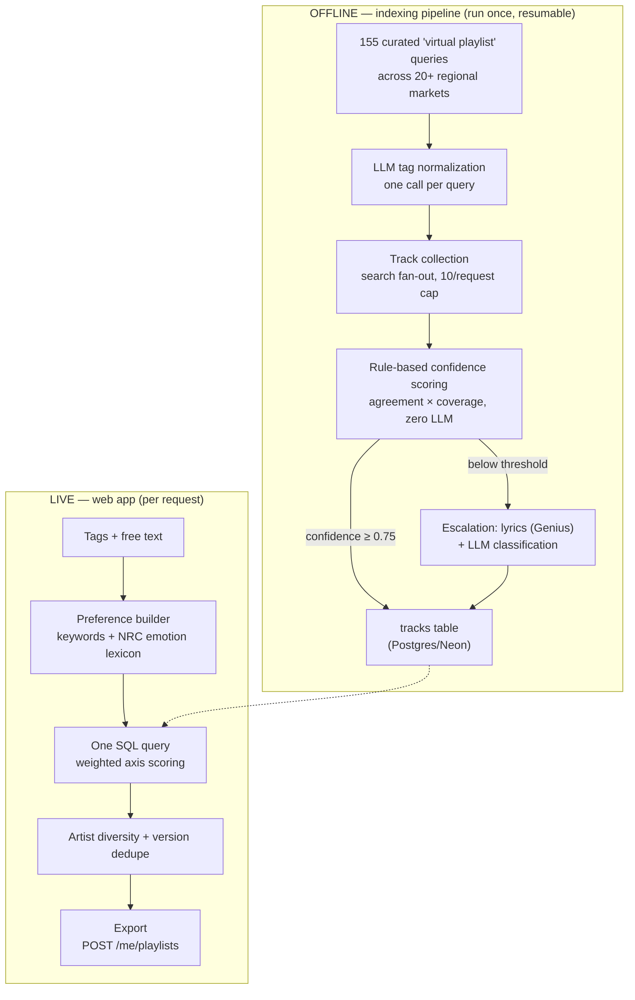

# Moodlist — mood-curated Spotify playlists from a pre-built multilingual index

**Live at [moodlist-app.vercel.app](https://moodlist-app.vercel.app)**

Type how you feel, spin a vinyl to pick the playlist length, and instantly
get a playlist of real Spotify tracks — Bollywood, Punjabi, Tamil, K-pop,
Afrobeats, Latin, pure instrumentals, and more — matched on language, genre,
energy, valence, and context. One click exports it to your Spotify account.

"AI playlist from a prompt" is a commoditized idea. What this project
actually solves is the two things those tools are consistently bad at:
**genuine multilingual accuracy** and **instrumental music**, backed by an
architecture that can say *how much* it trusts every tag it stores.

## Two systems, deliberately decoupled

**1. An offline indexing pipeline** (`scripts/indexer/`) builds a tagged
catalog of ~15k tracks in Postgres — run locally, checkpointed, resumable,
never deployed.

**2. A live web app** (Next.js on Vercel) answers queries with a single SQL
lookup over that index. No Spotify search, no lyrics fetching, no LLM at
request time — results are near-instant.



## Why "virtual playlists"

The original plan — harvest tracks from Spotify's editorial playlists — is
**impossible in 2026**: editorial playlists 404 for new apps (Nov 2024
policy), and the March 2026 API migration made *every* third-party
playlist's contents owner-only (metadata is all you get). Verified
empirically before building.

The replacement: a curated matrix of **155 search queries** ("hindi sad
songs", "peaceful piano instrumental", "k-pop party hits", …) fanned out
across 20+ regional markets (IN, KR, JP, BR, MX, NG, EG, …). Each query
plays exactly the role a playlist name used to play:

- The LLM normalizes each query into a structured tag object once (~155
  calls total).
- A track surfacing under multiple queries aggregates their signals — same
  agreement math as multi-playlist membership.
- Confidence per axis = `agreement × coverage`, combined with weights
  (language 0.30, genre 0.25, valence 0.20, energy 0.15, context 0.10).
- `≥ 0.75` overall → tags assigned rule-based, **zero LLM cost**. Below →
  escalation: Genius lyrics (when they exist) + one LLM call with full
  context. Lyrics are scored and **discarded — never stored, logged, or
  displayed**.

Every stored tag remembers whether it came from `aggregated` cross-query
agreement or `llm_escalated` classification, and the UI shows the
confidence on every track.

## The live query

Tag chips and free text merge into axis preferences three ways: an explicit
tag→axis map, a keyword table (`"hindi"`, `"workout"`, `"monsoon"`…), and —
for feeling words the tables don't cover ("missing someone, but hopeful") —
the offline **NRC Emotion Lexicon** read of the text, mapped down to
valence/energy. One weighted SQL query scores the whole index, then
version-dedupe (re-releases collapse to the best copy) and an artist
diversity cap shape the final list.

Extras that came out of real use:

- **History** — your last 15 unexported curations are snapshotted
  server-side; restore, delete one, or clear all. Exporting a playlist
  removes it from history (it lives in your Spotify account now).
- **Instrumental-only toggle** — a first-class filter, not a keyword hack.
- **Owner-only `/admin`** — login/curate/export activity, gated by Spotify
  user id (404s for everyone else).

## Engineering war stories (2026 Spotify API edition)

| Problem | Fix |
| --- | --- |
| Audio-features/analysis endpoints dead for new apps | Mood from index tags: query aggregation + confidence-gated LLM classification |
| Editorial playlists 404; third-party playlist contents owner-only (Mar 2026) | "Virtual playlists": curated multi-market search-query matrix |
| Artist `genres` field silently emptied; batch artists endpoint gone | Genre from query aggregation + LLM knowledge instead |
| `GET /search` hard-caps `limit=10` | Fan-out pagination; offsets verified working past 490 |
| Reading playlist items now requires a *user* token | One-time OAuth helper (`npm run index:auth`) stores a refresh token for the indexer |
| Free-tier LLM (GLM 5.2) took ~6 min/call in reasoning mode | Benchmarked NIM catalog; llama-3.1-8b-instruct does the same classification in 0.7s |
| Long runs died silently (hung fetch drains Node's event loop → exit 0) | Hard timeouts on every network call + idempotent, checkpointed steps — rerun until done |
| Spotify rejects `localhost` redirect URIs; Next.js normalizes `127.0.0.1` → `localhost` | Loopback-IP literal + calling `@auth/core`'s `Auth()` directly with a plain `Request` |

## Stack

Next.js (App Router) · TypeScript · Tailwind CSS 4 · Auth.js v5 (Spotify
OAuth) · Framer Motion · Postgres (Neon) · NVIDIA NIM (llama-3.1-8b, free
tier) for offline tagging · Genius + lrclib for escalation lyrics ·
deployed on Vercel.

## Run it locally

1. Spotify app at <https://developer.spotify.com/dashboard> with redirect
   URI `http://127.0.0.1:3000/api/auth/callback/spotify` (loopback IP —
   `localhost` is rejected).
2. A free [Neon](https://neon.tech) Postgres database.
3. `cp .env.local.example .env.local` and fill it in.
4. ```bash
   npm install
   npm run dev        # → http://127.0.0.1:3000
   ```

### Building the index (one-time, ~2-3 hours, free)

```bash
npm run index:auth       # one-time Spotify user grant (browser click)
npm run index:source     # register the 155-query source matrix
npm run index:tag        # LLM-normalize each query's tags…
npm run index:tag -- --review   # …review the map, then:
npm run index:tag -- --approve
npm run index:collect    # search fan-out → tracks (checkpointed per source)
npm run index:score      # rule-based confidence; splits auto vs escalate
npm run index:escalate   # lyrics + LLM for the low-confidence remainder
npm run index:summary    # distributions, auto/escalated split, failures
```

Every step is idempotent and resumable — kill and rerun freely.

## Key files

| Path | What it is |
| --- | --- |
| `scripts/indexer/queries.ts` | The virtual-playlist matrix: 155 queries × markets × authored tag hints |
| `scripts/indexer/04-score.ts` | The confidence math: per-axis agreement × coverage, weighted overall |
| `scripts/indexer/05-escalate.ts` | Lyrics + LLM escalation for ambiguous tracks only |
| `lib/query.ts` | Live matching: tag/keyword/NRC preference builder + weighted SQL scoring |
| `app/api/curate/route.ts` | The instant curate endpoint (DB lookup + history snapshot) |
| `app/api/history/route.ts` | Snapshot restore/delete/clear (cap 15, unexported only) |
| `app/api/auth/[...nextauth]/route.ts` | The `@auth/core` direct-call workaround for the loopback-origin bug |
| `components/SizeDial.tsx` | The spinnable vinyl: rotational drag, wheel, keyboard |

## Honest limitations

- **Catalog-bounded.** Results come from the ~15k-track index; a vibe far
  outside it gets the nearest neighbors, not a live search.
- **Tags are coarse.** Five axes + context tags, not a full embedding
  space. The win is that they're *trustworthy* (confidence-gated) and
  queryable in milliseconds.
- **Small-model escalation.** llama-3.1-8b knows mainstream music well;
  deep-catalog obscurities can still get generic tags.
- The index reflects when it was built; re-running the pipeline refreshes
  it (idempotent upserts).

## Attribution

Emotion data: [NRC Word-Emotion Association Lexicon](https://saifmohammad.com/WebPages/NRC-Emotion-Lexicon.htm)
(Saif M. Mohammad, NRC Canada), used non-commercially with attribution.
Escalation lyrics via Genius API and lrclib.net — scored in-memory, never
reproduced. Tagging inference via NVIDIA NIM.

Not affiliated with, endorsed by, or sponsored by Spotify.
